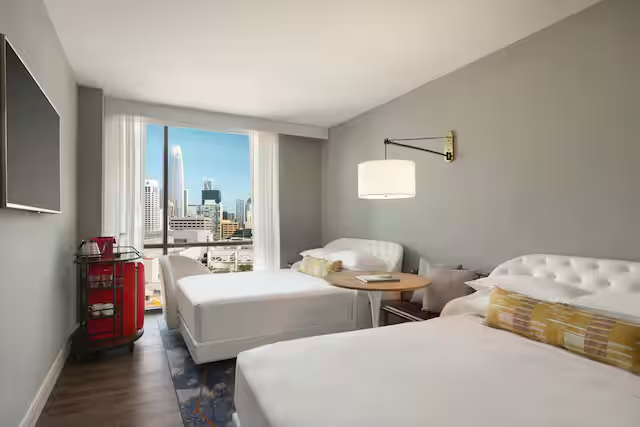

# Canopy by Hilton

#### About Canopy by Hilton – SF SoMa

Canopy by Hilton in San Francisco's vibrant SoMa district is a design-forward, urban lifestyle hotel known for its comfort, connectivity, and curated local experience. It’s perfectly positioned for founders, creators, and community members who want to stay close to Zo House SF and tap into downtown energy.



#### What This Partnership Means

This partnership designates **Zo World as a preferred partner** of Canopy by Hilton SF SoMa. It ensures that Zo House SF residents, guests, and collaborators have access to premium accommodations at exclusive rates and terms.&#x20;

***

#### Member Benefits

* Special Room Rates (Run of House rooms) for Zo guests

***

<figure><figcaption>
Canopy by Hilton
</figcaption></figure>

#### Important Notes

* Special rates apply only for individual travel (up to 9 rooms/night)
* Blackout Dates apply during major SF events&#x20;
* Bookings require credit card guarantees or pre-arranged company authorisation
